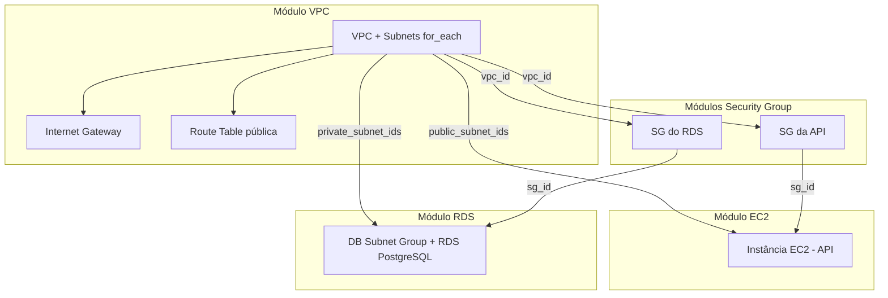

# Aula 06 — Biblioteca de Módulos Terraform (TechNova)

**Aluno:** Matheus Gabriel Correa Braga Viana
**RA:** 6325053
**Disciplina:** DevOps — UniFAAT 2026-2

## Visão geral

Esta é uma biblioteca de módulos Terraform reutilizáveis para provisionar
ambientes completos da TechNova (VPC, Security Groups, EC2 e RDS) na AWS.
Qualquer membro da equipe pode criar um novo ambiente (dev, staging, prod...)
chamando os mesmos módulos com variáveis diferentes — sem duplicar código.

Dois ambientes já estão prontos como exemplo: `environments/dev` e
`environments/staging`, usando exatamente os mesmos módulos com CIDRs, nomes
e bancos de dados diferentes.

## Arquitetura



A composição segue sempre o mesmo padrão: o **output** de um módulo alimenta
o **input** de outro (`module.vpc.vpc_id`, `module.api_sg.sg_id`, etc.),
demonstrado no `main.tf` de cada ambiente.

## Módulos disponíveis

### Módulo VPC (`modules/vpc`)

**Descrição:** Cria uma VPC completa com subnets dinâmicas (`for_each`),
Internet Gateway e Route Table pública associada apenas às subnets públicas.

**Inputs:**
| Nome | Tipo | Obrigatório | Descrição |
|------|------|-------------|-----------|
| `vpc_cidr` | string | Sim | CIDR block da VPC |
| `project_name` | string | Sim | Nome do projeto (tags/naming) |
| `environment` | string | Sim | Ambiente (dev, staging, prod) |
| `subnets` | map(object) | Sim | Mapa de subnets: `{ cidr, az, type }` |

**Outputs:**
| Nome | Descrição |
|------|-----------|
| `vpc_id` | ID da VPC criada |
| `vpc_cidr` | CIDR block da VPC |
| `public_subnet_ids` | Lista de IDs das subnets públicas |
| `private_subnet_ids` | Lista de IDs das subnets privadas |
| `subnet_ids` | Mapa completo chave → ID de cada subnet |

**Exemplo de uso:**
```hcl
module "vpc" {
  source       = "../../modules/vpc"
  vpc_cidr     = "10.0.0.0/16"
  project_name = "technova"
  environment  = "dev"
  subnets = {
    "public-1" = { cidr = "10.0.1.0/24", az = "us-east-1a", type = "public" }
  }
}
```

---

### Módulo Security Group (`modules/security-group`)

**Descrição:** Security Group genérico — serve para qualquer finalidade (API,
RDS, bastion, etc.). Recebe as regras de entrada como uma lista de objetos.

**Inputs:**
| Nome | Tipo | Obrigatório | Descrição |
|------|------|-------------|-----------|
| `name` | string | Sim | Nome do Security Group |
| `vpc_id` | string | Sim | ID da VPC |
| `ingress_rules` | list(object) | Não (default `[]`) | Regras de entrada |
| `egress_rules` | list(object) | Não (default: all outbound) | Regras de saída |
| `environment` | string | Sim | Ambiente |
| `project_name` | string | Sim | Nome do projeto |

**Outputs:**
| Nome | Descrição |
|------|-----------|
| `sg_id` | ID do Security Group criado |
| `sg_name` | Nome do Security Group criado |

**Exemplo de uso:**
```hcl
module "api_sg" {
  source       = "../../modules/security-group"
  name         = "technova-dev-api-sg"
  vpc_id       = module.vpc.vpc_id
  environment  = "dev"
  project_name = "technova"

  ingress_rules = [
    { from_port = 80, to_port = 80, protocol = "tcp", cidr_blocks = ["0.0.0.0/0"], description = "HTTP" }
  ]
}
```

---

### Módulo EC2 (`modules/ec2`)

**Descrição:** Cria uma instância EC2 reutilizável, com AMI, tipo, subnet e
Security Groups configuráveis.

**Inputs:**
| Nome | Tipo | Obrigatório | Descrição |
|------|------|-------------|-----------|
| `instance_name` | string | Sim | Nome da instância |
| `instance_type` | string | Não (default `t2.micro`) | Tipo da instância |
| `ami_id` | string | Sim | AMI ID |
| `subnet_id` | string | Sim | Subnet onde a instância será criada |
| `security_group_ids` | list(string) | Sim | Lista de SG IDs |
| `key_name` | string | Não | Key pair para SSH |
| `user_data` | string | Não | Script de inicialização |
| `environment` | string | Sim | Ambiente |
| `project_name` | string | Sim | Nome do projeto |

**Outputs:**
| Nome | Descrição |
|------|-----------|
| `instance_id` | ID da instância EC2 |
| `public_ip` | IP público (se em subnet pública) |
| `private_ip` | IP privado |

**Exemplo de uso:**
```hcl
module "api_server" {
  source              = "../../modules/ec2"
  instance_name       = "technova-dev-api"
  ami_id              = data.aws_ami.amazon_linux.id
  subnet_id           = module.vpc.public_subnet_ids[0]
  security_group_ids  = [module.api_sg.sg_id]
  environment         = "dev"
  project_name        = "technova"
}
```

---

### Módulo RDS (`modules/rds`)

**Descrição:** Cria um DB Subnet Group (em subnets privadas) e uma instância
RDS PostgreSQL, com configurações sensatas para desenvolvimento/estudo
(`skip_final_snapshot = true`, `multi_az = false`).

**Inputs:**
| Nome | Tipo | Obrigatório | Descrição |
|------|------|-------------|-----------|
| `db_name` | string | Sim | Nome do banco de dados |
| `db_username` | string | Sim | Usuário master |
| `db_password` | string (sensitive) | Sim | Senha master |
| `subnet_ids` | list(string) | Sim | Subnets privadas para o DB Subnet Group |
| `security_group_ids` | list(string) | Sim | SG IDs do RDS |
| `instance_class` | string | Não (default `db.t3.micro`) | Classe da instância |
| `environment` | string | Sim | Ambiente |
| `project_name` | string | Sim | Nome do projeto |

**Outputs:**
| Nome | Descrição |
|------|-----------|
| `db_endpoint` | Endpoint de conexão (host:porta) |
| `db_name` | Nome do banco de dados |
| `db_port` | Porta do banco de dados |

**Exemplo de uso:**
```hcl
module "database" {
  source              = "../../modules/rds"
  db_name             = "technova_dev"
  db_username         = "technova_admin"
  db_password         = var.db_password
  subnet_ids          = module.vpc.private_subnet_ids
  security_group_ids  = [module.rds_sg.sg_id]
  environment         = "dev"
  project_name        = "technova"
}
```

## Como usar (criar um novo ambiente)

1. Crie uma pasta em `environments/<novo-ambiente>/`
2. Copie `providers.tf`, `variables.tf`, `main.tf` e `outputs.tf` de um ambiente existente (são independentes de valores — só o `terraform.tfvars` muda)
3. Crie o `terraform.tfvars` com os valores do novo ambiente (CIDR, nomes, banco de dados)
4. Rode:
   ```bash
   cd environments/<novo-ambiente>
   terraform init
   terraform validate
   terraform plan
   ```

## Pré-requisitos

- [Terraform](https://developer.hashicorp.com/terraform/downloads) >= 1.0
- [AWS CLI](https://aws.amazon.com/cli/) configurado com credenciais válidas (AWS Academy Learner Lab)
- Um Key Pair criado na região `us-east-1` (para acesso SSH à instância EC2), caso queira rodar `terraform apply`

## Validação local

> Não é necessário rodar `terraform apply`. O requisito mínimo é `terraform validate` e `terraform plan` sem erros, em ambos os ambientes.

```bash
# Ambiente dev
cd environments/dev
terraform init
terraform validate
terraform plan

# Ambiente staging
cd ../staging
terraform init
terraform validate
terraform plan
```

> ⚠️ Se optar por rodar `terraform apply` para testar, **sempre** rode `terraform destroy` ao final para não consumir os recursos do Learner Lab. Nunca rode `apply` nos dois ambientes ao mesmo tempo (dobra o consumo de recursos).
